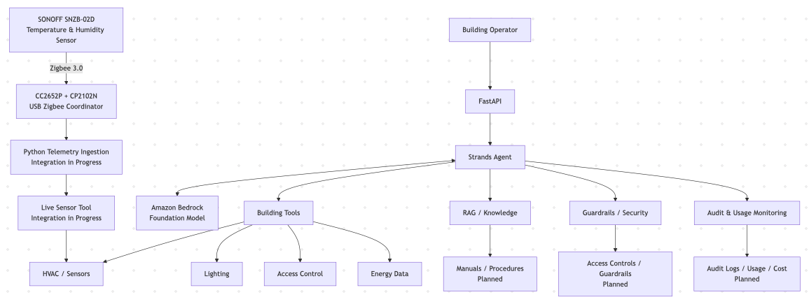
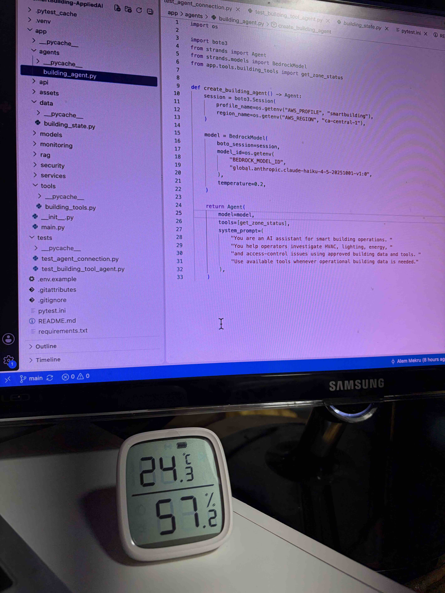

# SmartBuilding-AppliedAI

Applied AI platform for smart building operations using AI agents, Amazon Bedrock, RAG, tool calling, physical IoT telemetry, and enterprise building data.

The project demonstrates how an AI agent can help building operators investigate HVAC, environmental, lighting, energy, and access-control issues by combining foundation models with operational data, physical sensors, and enterprise tools.

## Architecture

<p align="center">
  
</p>

## Physical Sensor Integration

The project is extending beyond synthetic building data to incorporate real environmental telemetry from physical IoT hardware.

### Current Hardware

- **SONOFF SNZB-02D** Zigbee temperature and humidity sensor
- **CC2652P + CP2102N** Zigbee 3.0 USB coordinator
- Mac-based local development environment
- Python-based telemetry ingestion
- Strands Agents for agent orchestration and tool calling
- Amazon Bedrock for foundation-model inference

<p align="center">
  
</p>

<p align="center">
  <em>Physical SONOFF SNZB-02D acquired for the project. The display shows a real local environmental reading. Zigbee telemetry integration is currently in progress.</em>
</p>

### Target Telemetry Flow

```text
Physical SNZB-02D Sensor
        │
        │ Zigbee 3.0
        ▼
CC2652P USB Coordinator
        │
        ▼
Local Python Telemetry Ingestion
        │
        ▼
SmartBuilding-AppliedAI
        │
        ▼
Strands Agent
        │
        ▼
Amazon Bedrock
        │
        ▼
Grounded Operational Response
```

Communication between the physical sensor and Zigbee coordinator occurs locally and does not require Internet connectivity.

Internet connectivity is required when the application invokes Amazon Bedrock for foundation-model inference.

The first physical-hardware milestone is to replace hard-coded environmental values with live temperature and humidity measurements received from the SNZB-02D.

## Example Use Cases

The platform is being designed to answer operational questions such as:

- Why is Meeting Room 204 unusually warm?
- What are the current temperature and humidity readings for this space?
- Why is the third floor consuming unusually high energy?
- Show unusual after-hours access events.
- Are there active HVAC alarms affecting this zone?
- What maintenance history is relevant to this equipment?
- Does the current physical sensor reading indicate an environmental anomaly?

## Example Agent Interaction

The following example demonstrates the agent using Strands tool calling to investigate a smart-building issue using synthetic operational data.

### User Prompt

```text
Why is meeting_room_204 unusually warm? Use the available building data.
```

### Agent Tool Call

```text
Tool: get_zone_status
Zone: meeting_room_204
```

The tool retrieves the current operational state:

```text
Temperature:    26.8°C
Setpoint:       22.0°C
Occupancy:      6
HVAC Status:    fault
Active Alarm:   VAV-204 airflow fault
Lighting:       on
Access Status:  normal
```

### Grounded AI Response

```text
meeting_room_204 is unusually warm due to an HVAC fault.

The current temperature is 26.8°C compared with a 22.0°C setpoint,
which is 4.8°C above target.

The HVAC system reports an active "VAV-204 airflow fault." This indicates
that the VAV unit is not properly delivering conditioned air to the room,
preventing the zone from reaching its target temperature.

The recommended next step is to have HVAC maintenance investigate
VAV-204 and verify airflow after the fault is resolved.
```

This demonstrates the core agent workflow:

```text
User Question
     ↓
Strands Agent
     ↓
get_zone_status Tool
     ↓
Synthetic Building Data
     ↓
Amazon Bedrock Foundation Model
     ↓
Grounded Operational Response
```

> The operational building data shown in this example is synthetic and created specifically for this project. Physical sensor telemetry is being integrated separately and is not represented by the values in this example.

## Current Implementation

The current software implementation includes:

- Python 3.12 application environment
- FastAPI backend
- Health-check API
- Synthetic smart-building operational data
- Strands Agents integration
- Amazon Bedrock foundation-model integration
- Configurable Bedrock model selection
- Successful end-to-end Strands → Amazon Bedrock model invocation
- AWS authentication using a local AWS profile
- Canada Central (`ca-central-1`) as the development region
- Strands tool-calling integration
- Synthetic smart-building zone-status tool
- Agent reasoning over retrieved tool results
- Automated Bedrock agent connectivity testing with pytest
- Automated testing of tool-grounded responses

### Hardware Integration In Progress

The physical telemetry layer currently includes:

- SONOFF SNZB-02D physical temperature and humidity sensor acquired and operational
- CC2652P + CP2102N Zigbee 3.0 USB coordinator selected
- Local Zigbee telemetry ingestion into Python as the next implementation step
- Planned exposure of physical telemetry through Strands agent tools
- Progressive replacement of synthetic environmental readings with live measurements

No proprietary building or customer data is used.

Synthetic operational datasets are used for building systems that have not yet been connected to physical hardware.

## Planned Capabilities

Development will progressively add:

- Live Zigbee environmental telemetry ingestion
- Historical temperature and humidity telemetry
- HVAC and environmental sensor analysis tools
- Environmental anomaly detection
- Alarm investigation
- Lighting and energy analysis
- Access-control event analysis
- Retrieval-Augmented Generation (RAG)
- Equipment manuals and operational knowledge
- Role-based access controls
- AI guardrails
- Human approval for sensitive actions
- Audit logging
- Model usage and cost monitoring
- AI response evaluation and reliability testing

## Technology Stack

### Application and AI

- Python 3.12
- FastAPI
- Pydantic
- Strands Agents
- Amazon Bedrock
- AWS
- pytest

### Physical / IoT Layer

- SONOFF SNZB-02D temperature and humidity sensor
- Zigbee 3.0
- TI CC2652P Zigbee coordinator
- CP2102N USB interface
- Z-Stack 3.x coordinator firmware

Additional AWS services and building-system integrations will be introduced as the architecture evolves.

## Project Structure

```text
SmartBuilding-AppliedAI/
├── app/
│   ├── agents/
│   │   └── building_agent.py
│   ├── api/
│   ├── assets/
│   │   ├── architecture.png
│   │   └── snzb-02d-sensor.jpg
│   ├── data/
│   │   └── building_state.py
│   ├── models/
│   ├── monitoring/
│   ├── rag/
│   ├── security/
│   ├── services/
│   ├── tools/
│   │   └── building_tools.py
│   ├── __init__.py
│   └── main.py
├── tests/
│   ├── test_agent_connection.py
│   └── test_building_tool_agent.py
├── .env.example
├── .gitignore
├── pytest.ini
├── README.md
└── requirements.txt
```

The project structure will expand as the physical telemetry ingestion layer is implemented.

## Testing

The project includes automated integration tests covering:

- Strands → Amazon Bedrock model connectivity
- Agent tool calling against synthetic smart-building operational data
- Grounding AI responses in retrieved zone status, HVAC fault, and alarm data

Run the complete test suite with:

```bash
AWS_PROFILE=smartbuilding pytest tests/ -v
```

### Latest Verified Test Run

```text
platform darwin -- Python 3.12.10, pytest-9.1.1
collected 2 items

tests/test_agent_connection.py::test_agent_connection PASSED                [ 50%]
tests/test_building_tool_agent.py::test_agent_uses_building_data PASSED     [100%]

2 passed in 6.52s
```

The successful test run verifies that the application can:

1. Authenticate with AWS and invoke an Amazon Bedrock foundation model through a Strands agent.
2. Allow the agent to autonomously call the `get_zone_status` tool.
3. Retrieve synthetic operational building data.
4. Ground its response in retrieved values, including temperature, setpoint, HVAC status, and the `VAV-204 airflow fault`.

Physical Zigbee telemetry will receive separate automated and integration tests once the coordinator integration is operational.

## Data and Security Approach

The project is designed around separation between operational data acquisition and AI inference.

Physical sensor communication occurs locally through Zigbee. Building data is exposed to the AI layer through controlled application tools rather than giving the foundation model unrestricted access to underlying systems.

As the project evolves, the architecture will incorporate:

- Controlled tool access
- Role-based authorization
- Data minimization
- Audit logging
- Human approval for sensitive operations
- AI guardrails
- Response evaluation
- Usage and cost monitoring

No proprietary Delta Controls, customer, or production building data is used in this project.

## Development Status

🚧 **In active development**

The core FastAPI application, Strands agent framework, Amazon Bedrock model integration, AWS authentication, smart-building tool calling, and automated tests are operational.

The project is now moving from a fully synthetic environmental-data environment toward a hybrid physical/synthetic smart-building environment.

The next milestone is integrating live temperature and humidity telemetry from a physical SONOFF SNZB-02D Zigbee sensor through a CC2652P USB coordinator.

The resulting telemetry will be exposed to the Strands agent as an operational tool, allowing the foundation model running through Amazon Bedrock to reason over real environmental measurements.

Subsequent milestones will expand the platform with alarm, energy, maintenance, access-control, RAG, security, observability, evaluation, and AI-governance capabilities.

## Author

**Alem Mekru**

AI Engineer | MSc Artificial Intelligence | Doctoral Researcher in Applied Artificial Intelligence

- GitHub: https://github.com/AlemMekru
- LinkedIn: https://www.linkedin.com/in/alemmekru/